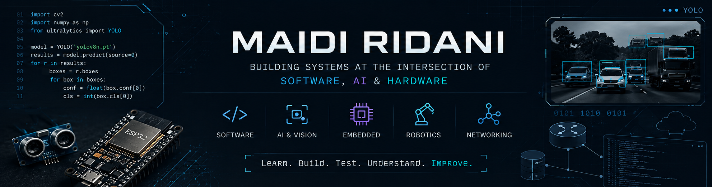
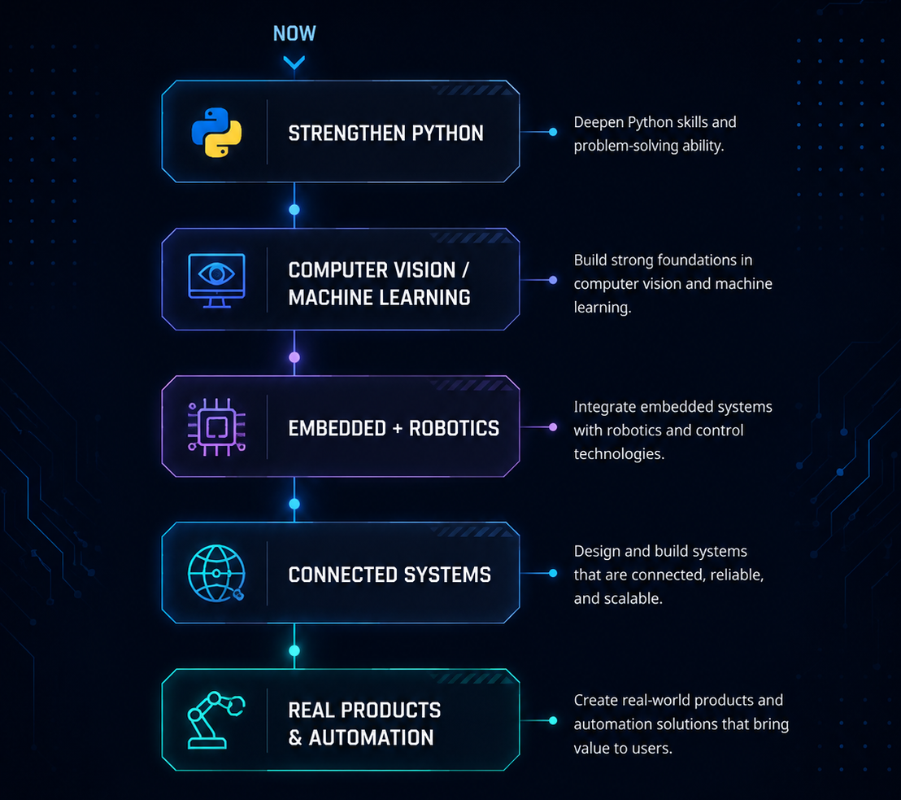
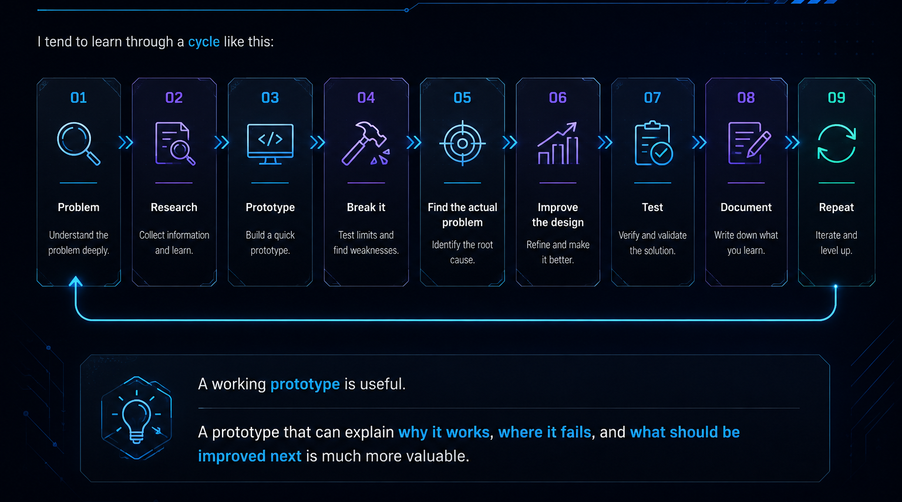
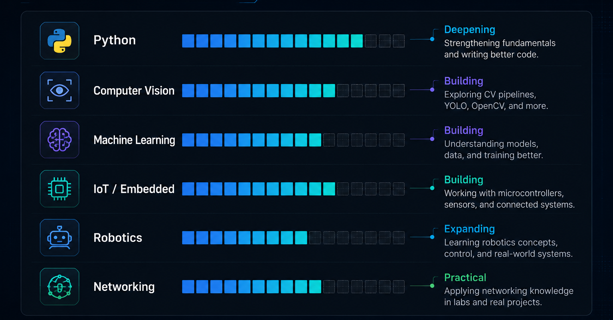

---

## About

I'm **Maidi Ridani**, an engineering-focused developer interested in building practical systems where **software meets the physical world**.

My current direction sits between **Python, AI, embedded systems, robotics, IoT, and networking**. I enjoy working from the problem itself and figuring out how different pieces of a system should communicate, rather than starting with a specific technology.

Most of my learning happens through projects: build something, test it, break it, figure out why, then improve it.

> **The goal isn't to collect technologies. It's to become capable of turning a real problem into something that actually works.**

---

## Current Direction

I'm currently putting more attention into **Python, Computer Vision, Machine Learning, Robotics, and Embedded Systems.**

The area that interests me most is the connection between **data, software, and physical systems** — where something is sensed from the real world, processed by software, and eventually turned into an action or useful decision.

---

## What I'm Building

<table>
<tr>

<td width="33%" valign="top">

### 🧠 Python & AI

Currently deepening Python while using it for:

- Computer Vision
- Machine Learning
- OpenCV
- YOLO
- Data processing

The focus is not only getting a model to run, but understanding the workflow around **data → training → evaluation → deployment**.

</td>

<td width="33%" valign="top">

### ⚙️ Embedded & Robotics

Building and experimenting with:

- ESP32
- Arduino
- Raspberry Pi
- Sensors & actuators
- Motor control
- AGV concepts
- Automation

The long-term direction is combining **sensing, control, vision, and AI** into physical systems.

</td>

<td width="33%" valign="top">

### 🌐 Networks & Systems

My networking background gives me another part of the stack:

- MikroTik
- Cisco
- Linux
- PNETLab
- Docker
- Monitoring
- Server infrastructure

I like the point where **software, hardware, and network constraints** have to work together.

</td>

</tr>
</table>

---

## Areas I'm Exploring

<table>
<tr>

<td width="50%" valign="top">

### Computer Vision

I'm exploring computer vision beyond simply running pretrained models.

Current areas include:

`Dataset Design` · `Annotation` · `YOLO` · `OpenCV`

`Detection` · `Evaluation` · `Preprocessing`

One practical direction is **industrial material / ore inspection and sorting**, where visual characteristics can be more important than simply detecting an object.

</td>

<td width="50%" valign="top">

### Machine Learning

I've worked with ML in projects involving **network and vehicle security**, including intrusion detection.

Current experience includes:

`Python` · `TensorFlow` · `Keras` · `NumPy`

`Dataset Processing` · `Training` · `Validation`

I'm focusing on understanding the fundamentals instead of treating ML as a black box.

</td>

</tr>

<tr>

<td width="50%" valign="top">

### IoT & Connected Systems

I've experimented with systems involving:

`ESP32` · `Arduino` · `WebSocket`

`Sensors` · `Actuators` · `Automation`

`Hardware ↔ Server Communication`

One example is **WifiCoin**, an ESP32-based system exploring the connection between physical transactions and network access.

</td>

<td width="50%" valign="top">

### Robotics

Robotics is an area I'm actively moving toward.

Current exploration:

`Mobile Robots` · `AGV` · `Ultrasonic`

`Line Tracking` · `Servo Control` · `Motor Control`

`Raspberry Pi` · `Arduino`

The goal is eventually to combine **embedded control, sensing, computer vision, and AI**.

</td>

</tr>
</table>

---

## Tech Stack

I don't consider every technology here a mastered skill. Some are part of my current work, while others are tools I've used and continue to improve.

<table>
<tr>

<td width="33%" valign="top">

### Primary Focus

**Python** is currently the language I'm putting the most effort into strengthening.

</td>

<td width="33%" valign="top">

### Embedded & IoT

Microcontrollers, sensors, actuators, communication, and physical systems.

</td>

<td width="33%" valign="top">

### Web

Used mainly to build interfaces, APIs, dashboards, and supporting systems.

</td>

</tr>

<tr>

<td width="33%" valign="top">

### Infrastructure

Linux environments, containers, servers, networking, and infrastructure experiments.

</td>

<td width="33%" valign="top">

### Networking

MikroTik, Cisco, PNETLab, routing, VLAN, VPN, firewall, monitoring, and network testing.

</td>

<td width="33%" valign="top">

### Engineering Tools

Also working with tools around electronics, PCB design, CAD, prototyping, and documentation.

</td>

</tr>
</table>

---

## Engineering Approach

I tend to learn through a simple loop:

**Problem → Research → Prototype → Break It → Understand → Improve → Test → Document → Repeat**

A working prototype is useful.

A prototype that can explain **why it works, where it fails, and what should be improved next** is much more valuable.

---

## Currently Learning

These indicators represent **where I'm currently putting learning effort**, not objective skill percentages.

---

## Beyond the Code

<table>
<tr>

<td width="33%" valign="top">

### ⚙️ Build

I want to move from isolated technical experiments toward systems that are actually usable.

**Prototype → Product**

</td>

<td width="33%" valign="top">

### 🤖 Apply

I'm interested in applying technology to physical and operational problems.

**Sense → Process → Decide → Act**

</td>

<td width="33%" valign="top">

### 🚀 Create Value

I'm also interested in the business side of technology.

**Problem → Solution → Customer → Value**

</td>

</tr>
</table>

The interesting part isn't only making technology work.

It's understanding **whether it solves a problem worth solving.**

---

## Activity

---

## What I'm Working Toward

My direction is gradually moving from **learning individual technologies** toward being able to design and build complete systems.

**Software → AI → Embedded → Robotics → Connected Systems → Real Products**

---

### Build. Test. Understand. Improve.

