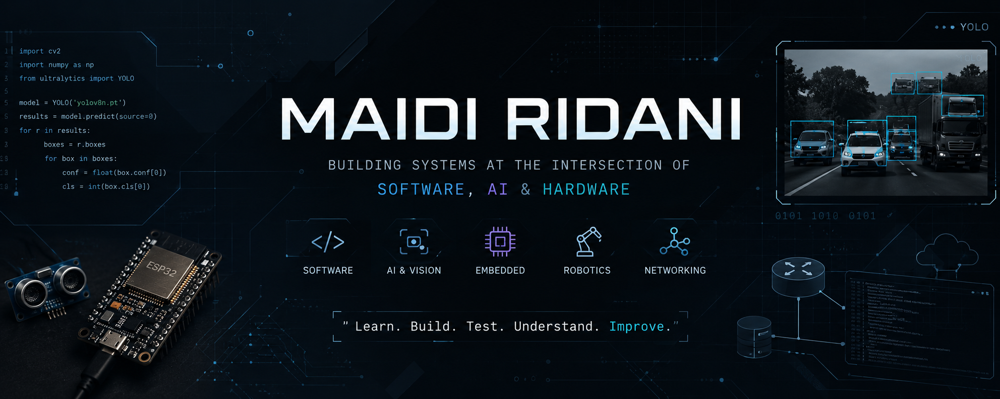

 

---

## About

I'm **Maidi Ridani**, an engineering-focused developer interested in building practical systems that connect software with the physical world.

My current interests sit around:

- **Python & software development**
- **Computer Vision & Machine Learning**
- **IoT & embedded systems**
- **Robotics & automation**
- **Computer networking & infrastructure**

I enjoy working from the problem itself rather than starting from a specific technology. Sometimes that means writing Python for a computer vision pipeline, training a model, connecting an ESP32 to a backend, building a network lab, or figuring out how hardware and software should communicate.

I don't consider every technology in my repositories a mastered skill. Some are tools I've used in projects, some are areas I'm actively learning, and some are experiments.

The goal is simple:

> **Build more real systems, understand why they work, and gradually move from prototypes to reliable implementations.**

---

## Current Direction

I'm currently putting more attention into **Python, Computer Vision, Machine Learning, Robotics, and Embedded Systems.**

I am particularly interested in systems where **data is captured from the physical world, processed by software, and turned into an action or useful decision.**

---

## What I'm Building

### Computer Vision

Currently exploring computer vision with **Python, OpenCV and YOLO**, with an emphasis on understanding the complete workflow rather than only running a pretrained model.

Areas I'm working through:

- Dataset preparation
- Image annotation and labeling strategy
- Object detection
- Model training and evaluation
- Confidence thresholds
- Image preprocessing
- OpenCV pipelines
- Real-world visual ambiguity
- Deployment considerations

One of my current directions is applying computer vision to **industrial material / ore inspection and sorting**, where visual characteristics can matter more than simply detecting the presence of an object.

---

### Machine Learning

I've worked with machine learning in projects involving **network and vehicle security**, including intrusion detection.

My experience includes working with:

- Python
- TensorFlow
- Keras
- NumPy
- Jupyter Notebook
- Dataset preprocessing
- Model training
- Validation
- Performance evaluation

I'm currently focusing on strengthening the fundamentals instead of treating ML as a black box.

---

### IoT & Embedded Systems

I've built and experimented with systems involving:

- ESP32
- Arduino
- Sensors and actuators
- WebSocket communication
- Microcontrollers
- Hardware-to-server communication
- Automation
- IoT dashboards
- Network-connected devices

One example is **WifiCoin**, an ESP32-based coin-operated WiFi system designed around the idea of connecting physical transactions with network access and backend logic.

---

### Robotics

Robotics is one of the areas I'm actively developing toward.

My current exploration includes:

- Mobile robots
- AGV concepts
- Ultrasonic sensing
- Line tracking
- Servo-based scanning
- Motor control
- Embedded control logic
- Raspberry Pi
- Arduino
- Sensor integration

The long-term direction is toward systems combining **embedded control, sensing, computer vision and AI**.

---

### Networking & Infrastructure

My background also includes practical networking and infrastructure work.

I've worked with and experimented around:

- MikroTik
- Cisco
- PNETLab
- Ubuntu Server
- VLAN
- Routing
- VPN
- Firewall
- Network monitoring
- Docker
- HAProxy
- InfluxDB
- Telegraf
- Grafana
- JMeter

I like networking because it forces software, infrastructure and real-world constraints to meet in one system.

---

## Selected Projects

| Project | Area | What it explores |
|---|---|---|
| **WifiCoin** | IoT / Networking | ESP32-based coin-operated WiFi system with real-time communication and planned MikroTik integration |
| **ComputerVision_Yolo_OpenCV** | Computer Vision | YOLO, OpenCV, dataset preparation, experiments and hands-on computer vision |
| **IDS_IN-Vehicle_Machine-Learning** | Machine Learning / Security | ML-based intrusion detection for in-vehicle networks and IoV |
| **enterprise-network-lab** | Networking | Enterprise network architecture using MikroTik, Cisco, Ubuntu Server and PNETLab |
| **personal-portofolio** | Web Development | Personal portfolio built with Next.js |
| **Extra-Vehicle-IDS** | ML / Security | Exploration of intrusion detection in vehicle-related systems |

More experiments and unfinished projects live here because I believe unfinished work can still be useful when it documents what was learned.

---

## Tech Stack

### Primary Focus

### Embedded & IoT

### Web & Backend

### Infrastructure & Networking

### Tools

> Some technologies above represent tools I've used in projects rather than technologies I claim to master. I'm still actively improving my depth across the stack.

---

## Engineering Approach

I tend to learn through a cycle like this:

A working prototype is useful.

A prototype that can explain **why it works, where it fails, and what should be improved next** is much more valuable.

---

## Currently Learning

---

## Beyond the Code

I'm interested not only in writing software, but also in **what can be built around it**.

That includes exploring:

- Technology products
- Automation solutions
- Robotics education
- IoT-based services
- Hardware/software products
- Practical applications of AI
- Technology entrepreneurship

I'm particularly interested in the gap between:

**technical prototype → usable product → real-world value**

Because building something technically interesting is only half of the problem.

---

## GitHub Activity

 

---

## A Few Things I'm Working Toward

---

### Build. Test. Understand. Improve.

